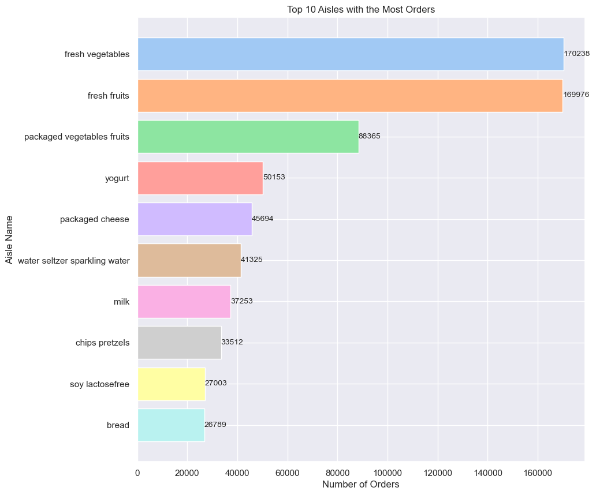
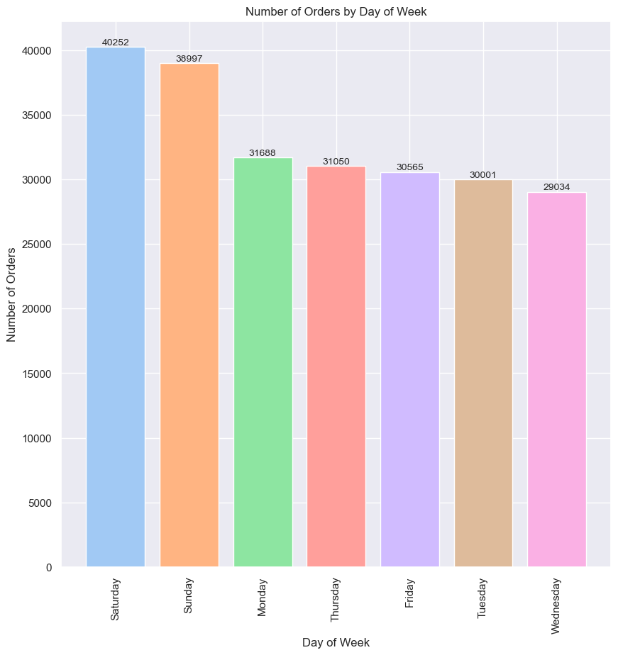
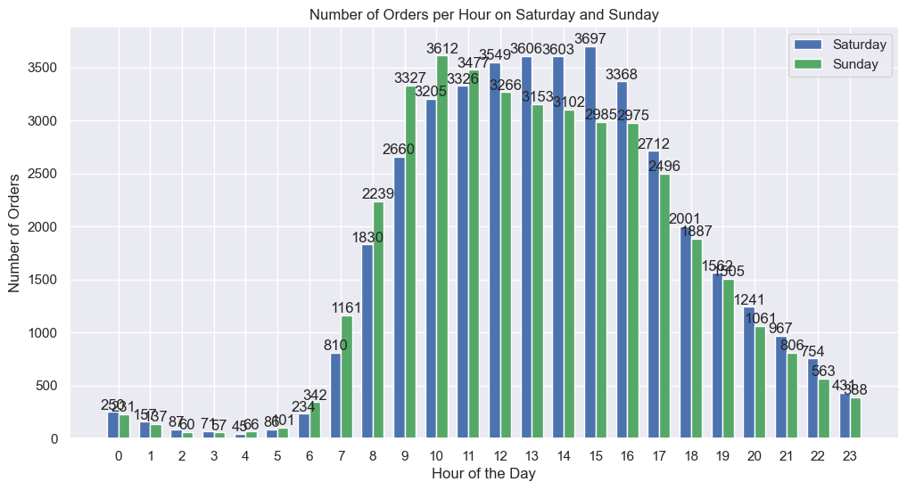
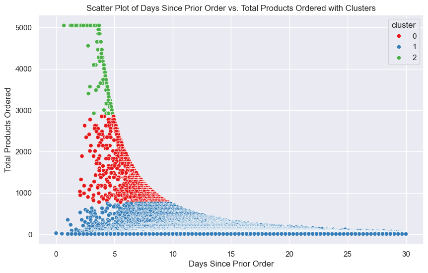
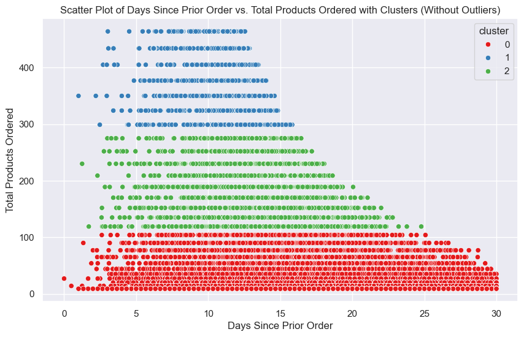
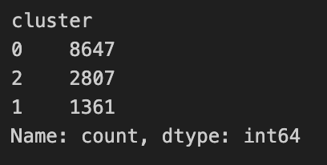

# Project - Instacart App Usage Analysis 📱

## Table of Contents

- [Project Overview](#project-overview)
- [Introduction](#introduction)
- [Hypotheses](#hypotheses)
- [Visualizations](#visualizations)
- [Conclusion](#conclusion)
- [Datasets used and useful links](#datasets-used-and-useful-links)

### Project Overview:

- The dataset for this project is a relational set of files describing customers' orders over time. The dataset is anonymized and contains a sample of over 3 million grocery orders from more than 200,000 Instacart users. For each user, we provide between 4 and 100 of their orders, with the sequence of products purchased in each order. We also provide the week and hour of day the order was placed, and a relative measure of time between orders. 

### Introduction:

- This project aims to analyze user behavior and sales patterns within the Instacart app to identify potential business opportunities. By examining data related to product orders, customer interactions, and shopping habits, we aim to provide actionable insights that can help enhance the user experience and drive sales growth.

### Hypotheses and Business Opportunities 💡

**1. Promoting High-Performing Aisles**

- **Hypothesis:** Promoting products from the highest-selling aisles will boost overall sales.

- **Opportunity:** Create targeted promotions and highlight these aisles on the app’s home page.

**2. Detecting patterns in order timing:**

- **Hypothesis:** Detecting patterns of orders during the week and at which time of the day such occurs.

- **Opportunity:** Implement features on the app to increase consumer interaction during peak times.

**3. Identify Customer Loyalty**

- **Hypothesis:** Establishing loyalty levels for different types of customers and developing a program to increase customer engagement and order frequency.

- **Opportunity:** Identify features from different customer groups (clusters) and try to increase loyalty and orders.

### Visualization 📈

### **1️⃣ Hypothesis - Promoting High-Performing Aisles**

*Approach:*

- Analyze sales data to identify the top-performing aisles.
- Determine the impact of these aisles on overall sales.
- Develop promotional strategies to feature products from these aisles prominently on the app.

### **2️⃣ Hypothesis - Detecting patterns in order timing**

*Approach:*

- Analyze order data to identify peak order times during the week and throughout the day.
- Determine the variations in order frequency between weekdays and weekends.
- Develop and implement features such as special weekend deals or notifications to encourage orders during identified peak times.

### **3️⃣ hypothesis - Identify Customer Loyalty**

*Approach:*

- Segment customers into different loyalty levels based on order frequency and behavior.
- Analyze the characteristics of each customer segment to identify key features.
- Develop targeted loyalty programs and marketing strategies to enhance customer engagement and increase order frequency within each segment.

### Conclusion

- This project provides valuable insights into user behavior and sales patterns within the Instacart app. By leveraging these insights, Instacart can implement targeted strategies to enhance the user experience, increase customer engagement, and drive sales growth.

### Datasets used and useful links

**Datasets:**

- [Kaggle Instacart Competition](https://www.kaggle.com/competitions/instacart-market-basket-analysis/data?select=sample_submission.csv.zip)

**Notion and Presentation:**

- [Project Management](https://cactus-burrito-0dd.notion.site/Project-Instacart-app-sales-854592432e90440faebe7b55cb11327b)
- [Presentation Goodle Slides](https://docs.google.com/presentation/d/1uiVZbRM3E4v7bWEqPsparMRku_oGHysH-yP8XjI5IK4/edit#slide=id.g10fb8bc67f7_0_0)

**Credits:**
*For any questions or further information, please contact:*

- [Alexandre Ribeiro](https://www.linkedin.com/in/alexandre-ribeiro-264445279/)
- [Rosa Evasari](https://www.linkedin.com/in/erlinarosaevasari/)

